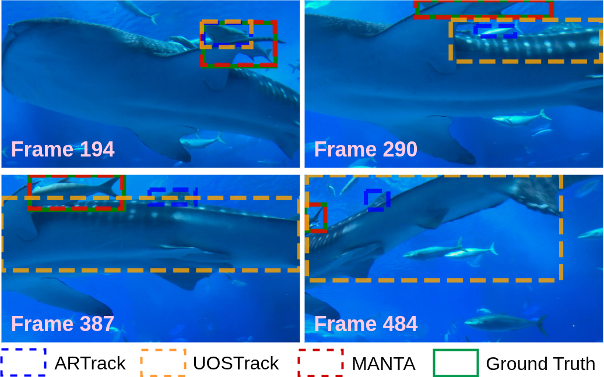
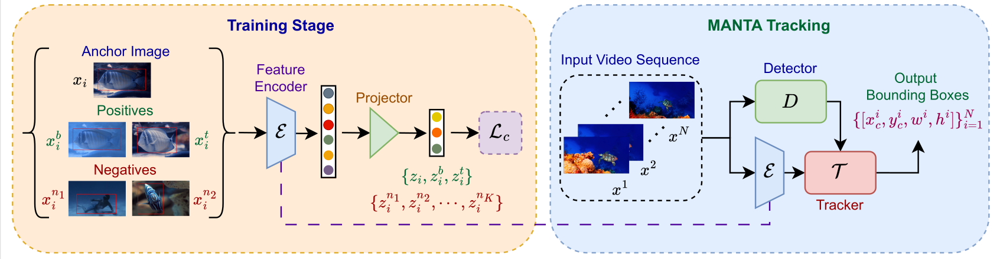

<div align="center">
<h1>MANTA</h1>
<h3>Physics-Informed Generalized Underwater Object Tracking</h3> 

\*[Suhas Srinath]()<sup>1</sup>  &nbsp;&nbsp;&nbsp; \*[Hemang J Jamadagni]()<sup>2</sup> &nbsp;&nbsp;&nbsp; [Aditya Chandrasekar]()<sup>1</sup> &nbsp;&nbsp;&nbsp; [Prathosh A P]()<sup>1</sup><br>
(\*) equal contribution

<sup>1</sup> Indian Institute of Science, <sup>2</sup> National Institute of Technology Karnataka

WACV 2026 ([conference paper](https://openaccess.thecvf.com/content/WACV2026/papers/Srinath_MANTA_Physics-Informed_Generalized_Underwater_Object_Tracking_WACV_2026_paper.pdf)) ArXiv Preprint([arXiv 2411.05886](https://arxiv.org/pdf/2511.23405v1))
</div>

## Abstract
Underwater object tracking is challenging due to wavelength-dependent attenuation and scattering, which severely distort appearance across depths and water conditions. Existing trackers trained on terrestrial data fail to generalize to these physics-driven degradations. We present MANTA, a physics-informed framework integrating representation learning with tracking design for underwater scenarios. We propose a dual-positive contrastive learning strategy coupling temporal consistency with Beer--Lambert augmentations to yield features robust to both temporal and underwater distortions. We further introduce a multi-stage pipeline augmenting motion-based tracking with a physics-informed secondary association algorithm that integrates geometric consistency and appearance similarity for re-identification under occlusion and drift. To complement standard IoU metrics, we propose Center-Scale Consistency (CSC) and Geometric Alignment Score (GAS) to assess geometric fidelity. Experiments on four underwater benchmarks (WebUOT-1M, UOT32, UTB180, UWCOT220) show that MANTA achieves state-of-the-art performance, improving Success AUC by up to 6%, while ensuring stable long-term generalized underwater tracking and efficient runtime. <br><br>



## Overview


## Usage
For a help Menu <br>
Run ```python <filename> -h```
### Setup Environment
```bash
conda create -n manta -f environment.yml
conda activate manta
```
### Dataset

Each dataset should follow this directory structure:
```text
<DatasetName>/ (e.g., UOT32)
├── <SequenceName_1>/ (e.g., FishFollowing)
    ├── img/
    │   │   ├── 000001.jpg
    │   │   ├── 000002.jpg
    │   │   └── ...
    │   └── groundtruth_rect.txt
    ├── <SequenceName_2>/
    └── ...
```

**Annotation Format:**
The `groundtruth_rect.txt` file contains the bounding box annotations for each frame in the sequence. Each line corresponds to a frame and follows this format:
```text
x [tab] y [tab] width [tab] height
```

### Training
#### Detector Training
The RF-DETR detector can to be finetuned on an underwater object tracking dataset. Edit the dataset paths and hyperparameters directly in `finetune_rfdetr.py`, then run:
```bash
python finetune_rfdetr.py
```

#### Train Physics Embedder  
The secondary association embedder is trained via a dual-positive contrastive learning framework , utilizing temporal constraints and Beer-Lambert physics-based augmentations. Run the following command with the appropriate paths:
```bash
python physics_contrastive_train.py \
    --annotation_file "path_to_annotations.json" \
    --img_root "path_to_image_directory" \
    --epochs 200 \
    --batch_size 16 \
    --loss_type improved_contrastive \
    --temperature 0.3 \
    --out_dir "outputs/"
```
### Inference
#### Detections
Generate initial bounding box detections (converts predictions to MOT format) using the finetuned RF-DETR model.
```bash 
python detector.py \
    --model "Models/detector.pth" \
    --dataset "dataset_name" \
    --dataset_path "dataset_path" \
    --output_path "detection_outputs"
```

#### Primary Association
Run primary motion-based tracking using OC-SORT on the generated detections to construct initial tracklets.
```bash
python primary_association.py \
    --hp \
    --out_path "primary_association_output" \
    --dataset "dataset_name" \
    --raw_results_path "detection_outputs"
```

#### Secondary Association
Perform vision-guided secondary association using the physics-informed embedder to recover lost tracks and output the final Single Object Tracking (SOT) format.
```bash
python secondary_association.py \
    --dataset "dataset_name" \
    --dataset_path "dataset_path" \
    --output_path "final_tracker_output" \
    --tracker_output "primary_association_output" \
    --cache_path "cache_path"
```
Use `--draw` flag to generate visualizaitons.


#### End to End Inference
Alternatively, you can run the complete pipeline directly using the integrated end-to-end script. Replace the dataset path with the actual path.
```bash
python end_to_end.py \
    --detector Models/detector.pth \
    --physics_emb Models/physics_emb.pth \
    --dataset_path "data_set_path" \
    --experiment_name experiment
```

### Evaluation

To evaluate your tracking results against the ground truth, use the provided `evaluation.py` script. This script computes standard tracking metrics (Success AUC, Precision AUC, Mean IoU) as well as the novel geometric metrics introduced in the paper: **Geometric Alignment Score (GAS)**, and **Center-Scale Consistency (CSC)**.

```bash
python evaluation.py \
    --dataset "dataset_name" \
    --dataset_path "dataset_path" \
    --results_path "final_tracker_output" \
    --output_dir "evaluation_results"
```

## Acknowledgments
We would like to thank and acknowledge the authors of **[OC-SORT](https://github.com/noahcao/OC_SORT)** and **[RF-DETR](https://github.com/roboflow/rf-detr)** for providing the foundational work and open-source implementations that were instrumental in building the MANTA framework.


## Citation
If you find MANTA useful in your research or applications, please consider giving us a star 🌟 and citing it using the following:

```bibtex
@InProceedings{Srinath_2026_WACV,
    author    = {Srinath, Suhas and Jamadagni, Hemang and Chandrasekar, Aditya and A P, Prathosh},
    title     = {MANTA: Physics-Informed Generalized Underwater Object Tracking},
    booktitle = {Proceedings of the IEEE/CVF Winter Conference on Applications of Computer Vision (WACV)},
    month     = {March},
    year      = {2026},
    pages     = {3472-3482}
}
```
